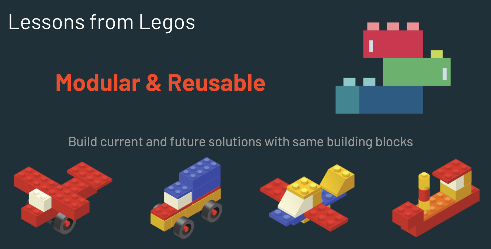
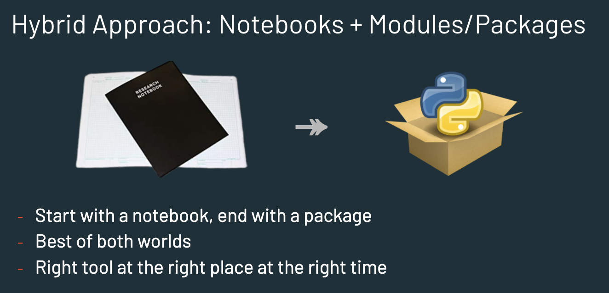

# Enterprise Scalable Data Science/Engineering Project Template

> In large enterprises, its not about how easy it is to build a new solution, but how easy it is to sustain, maintain, and scale a solution. 

Notebooks may be the in-thing that every data scientist or data engineer, who is just getting started with the field, may use. Notebooks are a great tool for experimenting data analysis or project, but it is not designed as a scalable solution for production. 

## What does using Notebooks lead to in Enterprises?
- Good for kaggle, MooCs
- Single notebook structure leads to Spaghetti Code and Big Ball of Mud
- Poor maintainability 
- Poor scalability
- Poor testability 
- Poor integrability
- Poor reusability
- In summary, 
  - Poor best practices for enterprise needs

# But What does Enterprises want?

## When to use Notebooks?
- Kaggle, MooCs
- As a scratch pad
- Ad hoc analysis
- One time analysis
- Experiments
- Quick POC
- Team showcasing analysis results to others

But remember,

# Hybrid Approach

# Benefits of Hybrid Approach
- Quick and easy to get started and begin prototyping with notebooks
- Transition to ‘coded with best practices’ with ease 
- Get full features of IDE from integrated terminal, code debug, variable inspectors, tabbed environments, autocomplete, intellisense, etc.
- Natural workflows and integrations with SCM/Git
- Easy to build test scripts, integrate with CI/CD pipelines
- Uses battle tested SDLC practices with Object Oriented Principles
- Modular & Reusable package along with above benefits leads to macro productivity of Enterprise Data Teams that produce Sustainable & Scalable solutions

# Enterprise Teams building the stack

# How to use this example project template?
1. Start with the general structure defined here. You can clone to get started.
    - `example_project` - main directory where notebooks and python files resides
    - `config` - Make your project configurable and host `config.ini`
    - `env` and `requirements.yaml` - Host python virtual env or preferably use conda to manage dedicated environment for each project.
    - `tests` - Host test scripts
    - `docs` - Host documentation of this project and package on how to use, extend, etc.
    - `build` and `dist` - To host files and artifacts generated while packaging 
    - `setup.py` - Setup file for packaging 
    - `pytest.ini` - Pytest configurations
    - `scheduler` - Details or scripts on how this project is scheduled to run
2. Setup a conda environment, and install any dependencies as needed.
3. In the `example_project` directory start with a `scratch` or `dev` notebook to access and explore data.
4. As you develop small snippets of working code, organize them as functions, which can then be moved over as modules.
5. Use relative reference to access newly created modules from notebook, while creating and testing new sections of the project. 
6. Continue above 2 steps interatively to add more features.
7. If needed, create an entry python file that can take command line arguments to execute the project.
8. As modules are developed, add test scripts in `tests` directory. This will allow for easy and automated CICD process.
9. Update `requirements.yaml` using conda to ensure dependencies are captured prior to commit.
10. Use `setup.py` to setup on how to package the modules as a library, etc. 
11. Host created artifacts within enterprise repo managers like artifactory or nexus to be accessed by other projects and teams with appropriate security measures. Also, use such tools to improve discoverability, etc.
12. Repeat this process for different aspects of building the data science/engineering stack within the organization to have reproducible and reusable solutions. 

